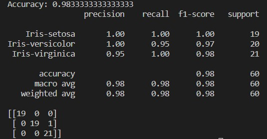
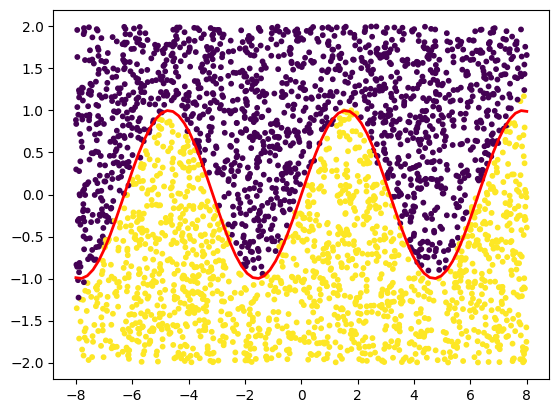

# Простая нейронная сеть

## FeedForward

Представляет из себя последовательное умножение матрицы весов слоя на входные данные и передачу результатов дальше

## BackPropagation

Полученный после *FeedForward* результат сравнивается с ожидаемым и вычисляется ошибка. Далее в соответствии с этой ошибкой и текущем состоянием весов вычисляются обновленные веса для слоев

___

## Тесты

### **Iris dataset**

Обучил нейросеть на известном датасете Ирисов Фишера

Полученные результаты:

### **Sin(x)**

На размеченных точках (выше/ниже sin(x)) обучил нейросеть, по координатам точки [x, y] классифицировать её расположение относительно sin

